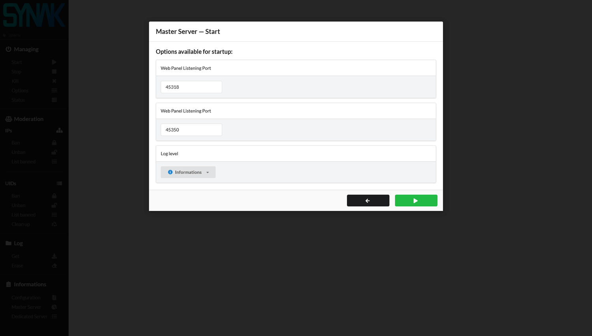
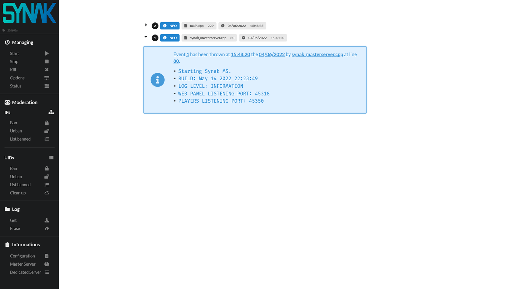
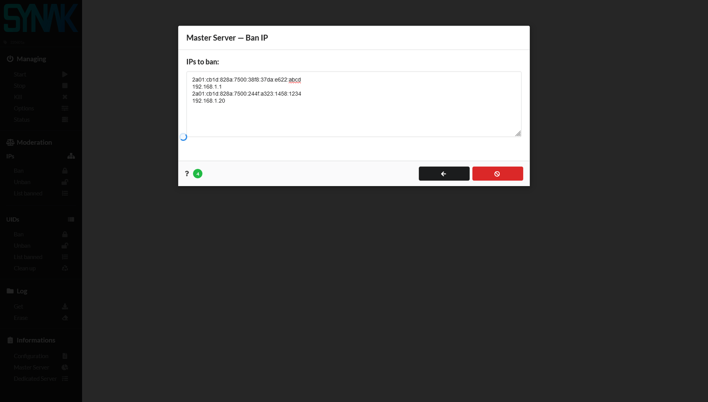
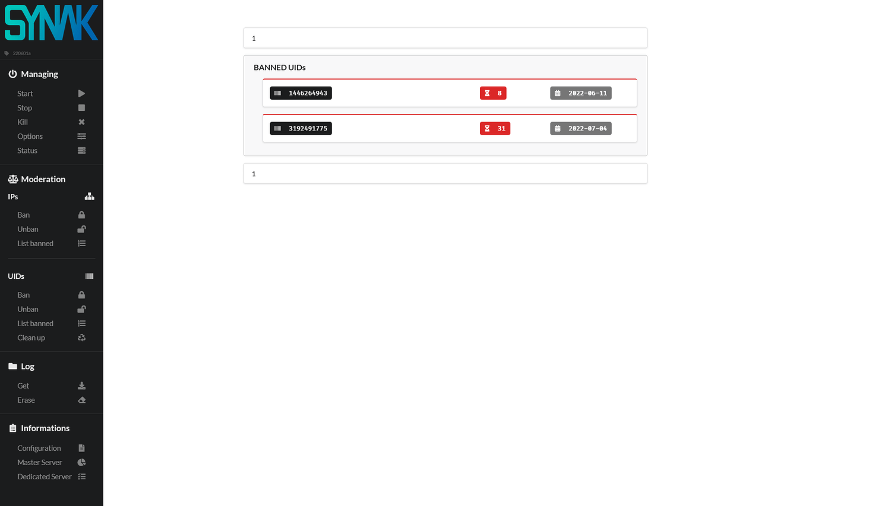
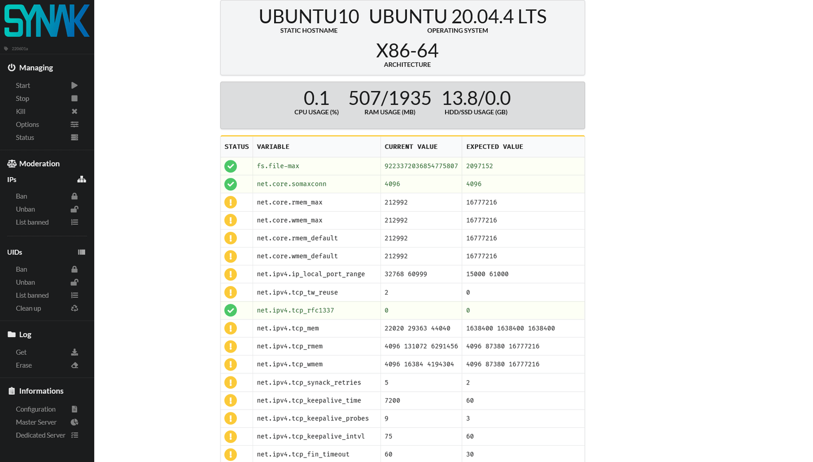

# :pushpin: Synak Web Panel

The **Web Panel** is a web portal through it is possible to manage the **Synak Master Server**, since both should be hosted on the same dedicated server.

&#160;

## How it works

The **index.html** is an empty shell using JavaScript to retrieving data from several Python scripts. These latter will retrieve data, format it and push it to the html.

&#160;

## What it looks like

&#160;
